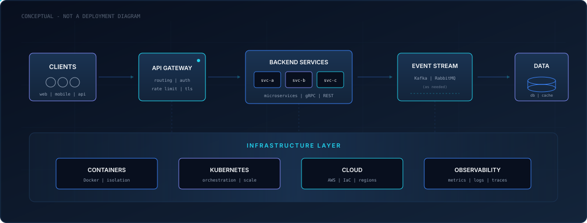

<!--
  OPSIDIAN - GitHub Profile README
  Brand: OPSIDIAN Cloud Architecture
  Profile: https://github.com/devcldkai229
-->

  <picture>
    <source media="(prefers-color-scheme: dark)" srcset="./assets/hero-dark.svg"/>
    <source media="(prefers-color-scheme: light)" srcset="./assets/hero-light.svg"/>
    
  </picture>

 

## Hi, I'm Opsidian

I'm a software engineer based in **Ho Chi Minh City, Vietnam**, focused on **backend systems**, **distributed architectures**, and **cloud-native infrastructure**. I care about how services scale, communicate, recover from failure, and stay observable under real workloads.

**Software Engineer | Backend & Distributed Systems | Cloud & DevOps**

  
  &nbsp;
  
  &nbsp;
  

---

### Engineering Focus

  
  
  
  

I work across the stack when needed, but my center of gravity is **server-side architecture**: service boundaries, messaging, data consistency, infrastructure automation, and reliability.

---

## Engineering Toolkit

### Languages

  

### Backend, APIs & AI

  
  &nbsp;
  
  
  
  

### Frontend

  
  &nbsp;
  

### Databases, Caching & Messaging

  
  &nbsp;
  
  

### Cloud, Containers & Infrastructure

  
  &nbsp;
  

### DevOps & Observability

  
  &nbsp;
  
  

### Robotics

  

### Toolchain

  
  &nbsp;
  
  

---

## How I Think About Systems

  <picture>
    <source media="(prefers-color-scheme: dark)" srcset="./assets/architecture-dark.svg"/>
    <source media="(prefers-color-scheme: light)" srcset="./assets/architecture-light.svg"/>
    
  </picture>

 

  <em>I care about more than making services work. I'm interested in how they behave under load, recover from failures, and evolve as systems grow.</em>

  
  
  
  
  
  

---

## Explore My Repositories

I keep experiments, systems work, and infrastructure explorations in my public repositories - browse them directly rather than through a curated shortlist.

  <picture>
    <source media="(prefers-color-scheme: dark)" srcset="./assets/explore-repos-dark.svg"/>
    <source media="(prefers-color-scheme: light)" srcset="./assets/explore-repos-light.svg"/>
    
  </picture>

 

  

---

## GitHub Activity

  
  &nbsp;
  

<!-- Contribution snake: enable after the first successful run of .github/workflows/snake.yml
     See docs/CUSTOMIZATION.md for setup steps.

  <picture>
    <source media="(prefers-color-scheme: dark)" srcset="https://raw.githubusercontent.com/devcldkai229/devcldkai229/output/github-contribution-grid-snake-dark.svg"/>
    <source media="(prefers-color-scheme: light)" srcset="https://raw.githubusercontent.com/devcldkai229/devcldkai229/output/github-contribution-grid-snake.svg"/>
    
  </picture>

-->

---

## Connect

  <a href="https://github.com/devcldkai229">GitHub</a>
  |
  <a href="https://github.com/devcldkai229?tab=repositories">Repositories</a>
  |
  <a href="https://www.linkedin.com/in/opsidian-ngykhai">LinkedIn</a>

 

  

